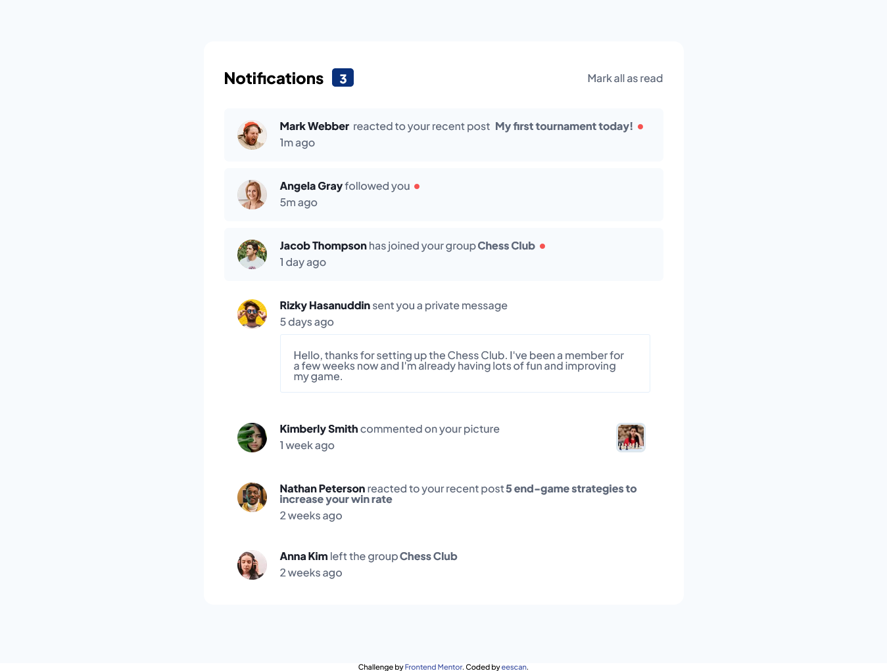
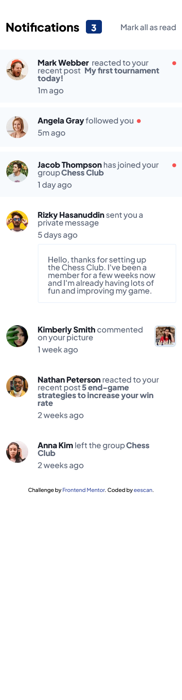

# Frontend Mentor - Notifications page solution

This is a solution to the [Notifications page challenge on Frontend Mentor](https://www.frontendmentor.io/challenges/notifications-page-DqK5QAmKbC). Frontend Mentor challenges help you improve your coding skills by building realistic projects.

## Table of contents

-   [Overview](#overview)
    -   [The challenge](#the-challenge)
    -   [Screenshot](#screenshot)
    -   [Links](#links)
-   [My process](#my-process)
    -   [Built with](#built-with)
-   [Author](#author)

## Overview

### The challenge

Users should be able to:

-   Distinguish between "unread" and "read" notifications
-   Select "Mark all as read" to toggle the visual state of the unread notifications and set the number of unread messages to zero
-   View the optimal layout for the interface depending on their device's screen size
-   See hover and focus states for all interactive elements on the page

### Screenshot

### Links

-   Solution URL: [github solution]([https://your-solution-url.com](https://github.com/iskandar13abdurakhmonov/notification-page))
-   Live Site URL: [netlify live server!]([https://your-live-site-url.com](https://main--gleaming-semolina-081ceb.netlify.app/))

## My process

### Built with

-   Semantic HTML5 markup
-   Flexbox
-   Desktop-first workflow
-   [React](https://reactjs.org/) - JS library
-   [Styled Components](https://styled-components.com/) - For styles

## Author

-   Frontend Mentor - [@eescan](https://www.frontendmentor.io/profile/eescan)
-   Twitter - [@ab65485](https://www.twitter.com/@ab65485)
